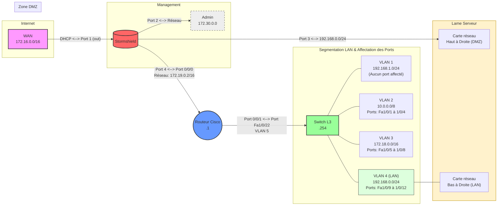

# ` 🌐 `︲Infrastructure Réseau (Switch L3 & Routeur)

<p align="center">
  
  
</p>

---

## `  🌐  ` ︲ `  🗺️  `︲Shéma Réseau



---

## ` 📌 `︲Vue rapide

```

Internet
|
[ISR4221]
|
[SW L3 3750]
|
|── VLAN 2 → 10.0.0.0/8
|── VLAN 3 → 172.18.0.0/16
|── VLAN 4 → 192.168.0.0/24 (DHCP)
|── VLAN 1 → 192.168.1.0/24 (Mgmt)

```

---

## ` 📡 `︲Routeur (ISR4221)

### Interfaces
- `Gi0/0/0` → WAN  
  `172.19.0.2` → Gateway `172.19.0.1`

- `Gi0/0/1` → LAN  
  `172.17.0.1` → vers switch (VLAN 5)

---

### NAT
- NAT overload actif côté WAN (`Gi0/0/0`)
- Réseaux autorisés :
  - `10.0.0.0/8`
  - `172.18.0.0/16`
  - `192.168.0.0/24`
  - `192.168.1.0/24`
  - `172.17.0.0/16`

---

### Routage
- Default route → `172.19.0.1`
- Routes internes : (Permettent le retour vers le Switch de niveau 3)
  - `10.0.0.0/8` → `172.17.0.255`
  - `172.18.0.0/16` → `172.17.0.255`
  - `192.168.0.0/24` → `172.17.0.255`

⚠️ Next-hop en `.255` (broadcast) → à vérifier selon design réel

---

### Accès / sécurité
- SSH only
- HTTP off
- CDP off

---

## ` 🖧 `︲Switch L3 (3750v2)

### VLANs

| VLAN | IP | Réseau | Ports |
|------|--------|--------|------|
| 1 | 192.168.1.250 | Mgmt | - |
| 2 | 10.0.0.255 | 10.0.0.0/8 | Fa1/0/1-4 |
| 3 | 172.18.0.255 | 172.18.0.0/16 | Fa1/0/5-8 |
| 4 | 192.168.0.254 | 192.168.0.0/24 | Fa1/0/9-12 |
| 5 | 172.17.0.255 | 172.17.0.0/16 | Fa1/0/22 (uplink routeur) |

---

### Routage
- `ip routing` actif
- Default route → `172.17.0.1` (routeur)

---

### DHCP
- Serveur DHCP : Sur serveur AD → `192.168.0.1` (VLAN 4)
- Helper configuré sur :
  - VLAN 2 : 10.0.0.1 à 10.0.0.254, Passerelle : 10.0.0.255, Serveur DNS : 192.168.0.1
  - VLAN 3 : 10.0.0.1 à 10.0.0.254, Passerelle : 10.0.0.255, Serveur DNS : 192.168.0.1

---

### Accès
- HTTP / HTTPS actifs
- Certificat auto-signé

---

## ` 🔁 `︲Flux réseau

### Interne
- Routage inter-VLAN assuré par le switch

### Cheminement d'un client pour acceder à Internet :
1. Client → VLAN
2. Switch → routeur (`172.17.0.1`)
3. NAT → sortie WAN

---

---
